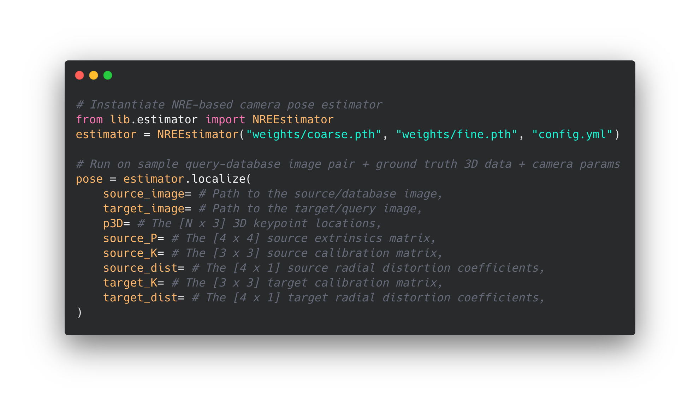

# Neural Reprojection Error: Merging Feature Learning and Camera Pose Estimation (CVPR 2021)

This is the official repository for our paper, which contains model weights and source code to perform NRE-based absolute camera pose estimation.

[[Paper](https://openaccess.thecvf.com/content/CVPR2021/papers/Germain_Neural_Reprojection_Error_Merging_Feature_Learning_and_Camera_Pose_Estimation_CVPR_2021_paper.pdf)]
[[Supp.Mat.](https://openaccess.thecvf.com/content/CVPR2021/supplemental/Germain_Neural_Reprojection_Error_CVPR_2021_supplemental.pdf)]
[[ArXiv](https://arxiv.org/abs/2103.07153)]
[[Website](https://www.hugogermain.com/nre)]

## :gear: Dependencies

This repository was tested with the following packages, other versions should be compatible:

* Python 3.8.5
* PyTorch 1.8.1
* PyTorch Lightning 1.2.10
* OpenCV 4.5.1
* Plotly 4.10.0
* NumPy 1.19.2
* coloredlogs 15.0

They can all be installed following command:  
`pip3 install numpy opencv-python torch torchvision pytorch-lightning plotly coloredlogs`

## :test_tube: Running

For a given pair of images, localizing with the NRE-based pose estimator is as simple as:

<p align="center">

</p>

## :video_game: Try it

You can run NRE-based camera pose estimation on a Megadepth validation sample in `example.ipynb`.
You will need to have the aforementionned dependencies installed, as well as a GPU with 8Gb+ memory.
For simple visualization of the notebook try [this link](https://nbviewer.jupyter.org/github/germain-hug/NRE/blob/main/example.ipynb).

## :control_knobs: Additional parameters

For additional control over NRE-based camera pose estimation, you can tweak several parameters in `config.yml`.
Notably:
- `skip_gnc`: Skip the coarse and fine GNC-IRLS refinement steps
- `n_iter_p3p`: The number of P3P iterations
- `top_n_p3p`: The fraction of top-N maps to run P3P.
- `max_fine_imsize`: The maximum image size for the fine forward pass. This can be reduced if you encounter memory issues, although this will most likely lead to loss in accuracy.
- `coarse_sigma_max` and `coarse_sigma_min`: Control the sigma upper and lower boundaries for the coarse GNC-IRLS. Analogous parameters are available for the fine GNC-IRLS.
- `use_re=True`: This additional parameter can be passed in the `estimator.localize()` method. This setting corresponds to Eq. 11 minimization in the paper).

## :page_with_curl: BibTex

Please consider citing our work:

```bibtex
@InProceedings{Germain_2021_CVPR,
    author    = {Germain, Hugo and Lepetit, Vincent and Bourmaud, Guillaume},
    title     = {Neural Reprojection Error: Merging Feature Learning and Camera Pose Estimation},
    booktitle = {Proceedings of the IEEE/CVF Conference on Computer Vision and Pattern Recognition (CVPR)},
    month     = {June},
    year      = {2021},
    pages     = {414-423}
}
```

## :busts_in_silhouette: Acknowledgments 

This codebase reuses some code snippets originally written by [Paul-Edouard Sarlin](https://psarlin.com/) for [PixLoc](https://github.com/cvg/pixloc).

